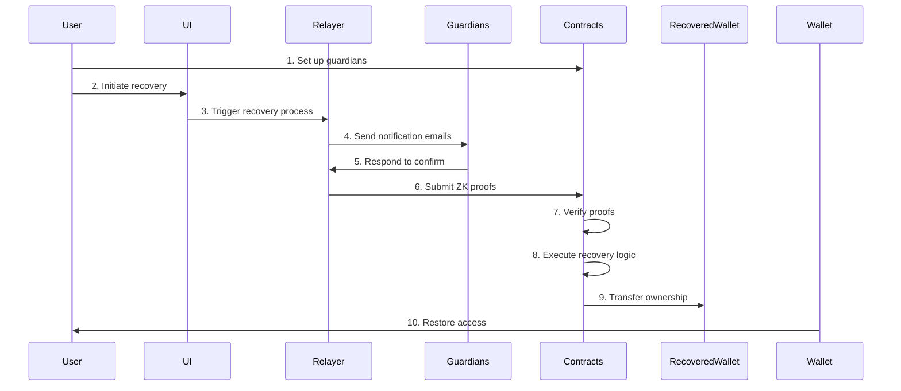

# Account Recovery

The Account Recovery Component allows users to regain access to their Ethereum smart wallets using their email addresses. This approach uses ZK Email technology to verify email replies and trigger account recovery processes, all while maintaining high levels of security and privacy.


Account recovery is a crucial component of the ZK Email Ecosystem, providing a secure and user-friendly way to recover Ethereum smart wallets using email addresses.


## Key Features and Benefits

Our Account Recovery Component offers a range of features that enhance security, privacy, and user experience:

* **Email-based Recovery**: Recover your wallet by simply responding to an email.
* **No Need for Seed Phrases**: Eliminate the risk of losing access due to misplaced seed phrases.
* **Privacy-Preserving**: Utilizes zero-knowledge proofs to maintain user privacy.
* **Customizable**: Developers can define custom recovery logic.
* **User-Friendly**: Simplifies the recovery process for non-technical users.

## How It Works

The account recovery process involves both user interactions and technical operations:

1. **Setup**: The user designates email addresses as guardians for their wallet.
2. **Initiation**: When recovery is needed, the user starts the process via a web interface.
3. **Notification**: The system sends emails to the designated guardians.
4. **Confirmation**: Guardians respond to the emails to confirm the recovery request.
5. **Verification**: The system uses ZK proofs to verify the authenticity of guardian responses.
6. **Execution**: Smart contracts validate the proofs and execute the recovery logic.
7. **Completion**: The wallet's ownership is transferred to the recovered address.

The Account Recovery system consists of several key components:

1. **Ether-Email-Auth SDK**: Allows developers to define email-triggered smart contract logic.
2. **ZK Email Verification**: Ensures the authenticity of email responses without revealing sensitive information.
3. **Relayer**: A permissionless server that facilitates communication between off-chain emails and on-chain contracts.
4. **Smart Contracts**: Handle the on-chain logic for account recovery.

## Concepts

The Account Recovery Component introduces several concepts that work together to provide a secure, privacy-preserving, and flexible framework for email-based wallet recovery and smart contract interactions.

These concepts leverage advanced cryptographic techniques and zero-knowledge proofs to bridge the gap between traditional email communication and blockchain technology.


These concepts form the foundation of our secure and privacy-preserving account recovery system. For a detailed explanation, watch our [2024 EthCC talk](https://ethcc.io/archive/ZK-Email-Decentralized-Email-Login-Account-Recovery-2FA).


### Account Code and Salt

A random integer (Account Code) and its derivative (Account Salt) that together create a privacy layer between email addresses and Ethereum addresses. They enable deterministic wallet address generation and secure recovery without exposing user email addresses.


`userEtherAddr := CREATE2(hash(userEmailAddr, accountCode))`


Example

Alice's email (alice@example.com) and Account Code (1234) generate a unique Account Salt, which determines her Ethereum address (0x1234...) without revealing her email on-chain.

### Invitation Code

A hex string composed of the account code and a prefix, included in email headers to verify user authenticity and prevent malicious activities during the recovery process. It ensures that only the rightful user can initiate account recovery by proving possession of the correct Invitation Code.


Smart contracts must verify the presence of the invitation code in a user's first email before confirming their account.


Example

Alice's Invitation Code "INV-1234abcd" is included in her recovery email, proving she has access to the original account setup information.

### Subject Template

A predefined format for email subject lines that enables developers to create custom, application-specific email commands without modifying the underlying ZK circuits. It standardizes email communication for smart contract interactions, allowing for complex operations through simple email subjects.


Variable parts: `"{string}"`, `"{uint}"`, `"{int}"`, `"{decimals}"`, `"{ethAddr}"`


Example

Template "Send {decimals} ETH to {ethAddr}" allows Alice to email "Send 0.5 ETH to 0x5678..." to trigger a transaction.

### Email-Auth Message

A data structure containing the user's email data, its zero-knowledge proof, and additional metadata for verifying email-based interactions with smart contracts. It facilitates secure communication between off-chain emails and on-chain smart contracts while preserving user privacy.


The `isCodeExist` boolean indicates the presence of an invitation code without disclosing its content.


Example

Alice's recovery email generates an Email-Auth Message containing a ZK proof of her email content and the `isCodeExist` flag, allowing the smart contract to verify her recovery request without exposing her email address.

